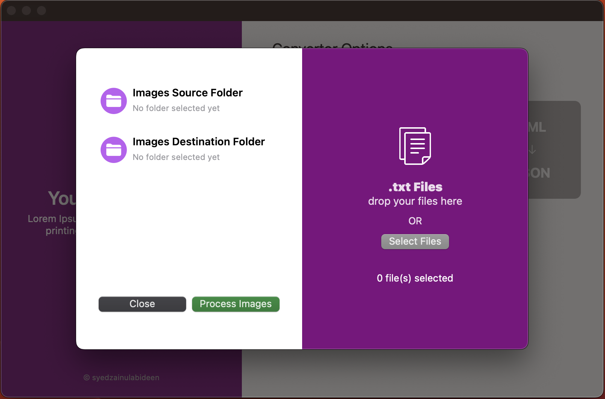

# **Annotation Converter**

Annotation Converter is a macOS app that allows you to convert annotation files between different formats. With this app, you can easily convert your annotation files from TXT format to JSON format, making it more convenient for various applications.


## **Screenshots**



## **Features**

- Convert annotation files from TXT to JSON format.
- Intuitive and user-friendly interface.
- Supports batch conversion for multiple files.
- Lightweight and fast processing.

## **Getting Started**

To get started with Annotation Converter, follow these steps:

1. Clone the repository to your local machine:
    
    ```bash
    
    git clone https://github.com/your-username/annotation-converter.git
    
    ```
    
2. Open the Xcode project in Xcode.
3. Build and run the project.
4. Use the app's graphical interface to select the TXT files you want to convert.
5. Choose the output directory and format (currently only supports TXT to JSON).
6. Click the "Convert" button to start the conversion process.
7. Once the conversion is complete, the converted JSON files will be saved in the output directory.

## **Future Work**

The current version of Annotation Converter only supports converting TXT files to JSON format. However, we have plans to add support for additional formats, including XML and JSON to TXT conversions, in future updates. We are continuously working on improving the app and adding new features based on user feedback.

If you have any suggestions, feature requests, or bug reports, please feel free to open an issue on the GitHub repository. We appreciate any contributions or feedback from the community.

## **License**

This project is licensed under the MIT License - see the **[LICENSE](https://chat.openai.com/LICENSE)** file for details.

## **Acknowledgments**

- **[Swift](https://swift.org/)** - The programming language used.
- **[Xcode](https://developer.apple.com/xcode/)** - The integrated development environment (IDE) used.

## **Contact**

For any questions or inquiries, please contact the project maintainer:
